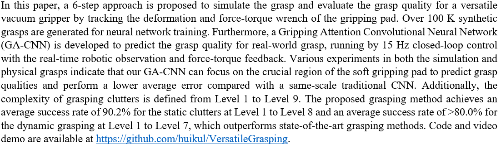
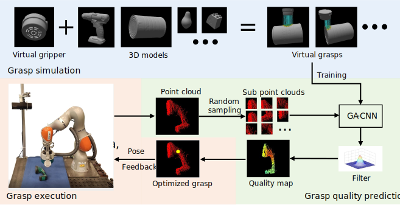
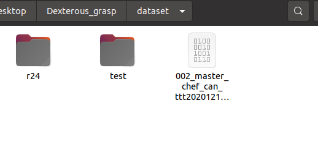

# Introduction
### In this repository, we only provide the code for the GA-CNN training with a mini dataset.

## Abstract




## Extra explanation
1) This repository has been tested on Ubuntu 16.0 (python 3.6) and Ubuntu 20.0 (python 3.8), and the following tutorial is based on Ubuntu 20.0 (python 3.8).


# Video demo
1. https://youtu.be/aPh1wOYH1Pw
2. https://1drv.ms/v/s!Aok6lAYtb5vYzSLKD_62hTI4DCRa?e=WLShMW (backup)

# Training a neural network
1. Here we provide a brief training demo based on a mini dataset. Please download the mini dataset [here](https://drive.google.com/file/d/1fJBxswzjU5H4lqjVxG3UMEkH3Qm9gaUu/view?usp=sharing).

2. Unzip the mini dataset and copy them into the path `$HOME/$PATH OF YOUR REPOSITORY$/dataset`.  
      
    
3. Launch the visualization webpage:
    ```bash
    cd $HOME/$PATH OF YOUR REPOSITORY$/NeuralNetwork/data
    python -m visdom.server -port 8031 -env_path ~/$PATH OF YOUR REPOSITORY$/NeuralNetwork/data
    ```
4. Open your web browser, and visit the webpage below to monitor the training progress:
    ```bash
    http://localhost:8031/
    ```

5. Start training:
    ```bash
    cd $HOME/$PATH OF YOUR REPOSITORY$/NeuralNetwork/data
    python train_DexVacuum_Linr_80.py
    ```

### Extra tips for neural network training

1. Backup links [1](https://1drv.ms/u/s!Aok6lAYtb5vYzFpoUwuhR24el4xr?e=deWaV1), [2](https://kuleuven-my.sharepoint.com/:u:/g/personal/hui_zhang_kuleuven_be/EWqD4-A8Hy5IrFRo-6aKQN4BX6hK5GQ_6gOiBRgY0WCVmQ?e=oDFLn0) to download our mini dataset.

# Citation
## **Will be available soon.**


